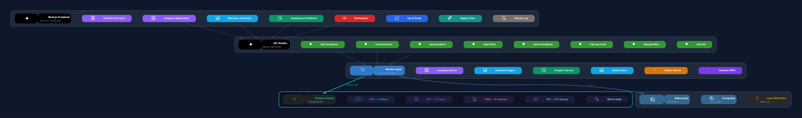
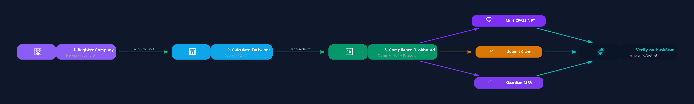
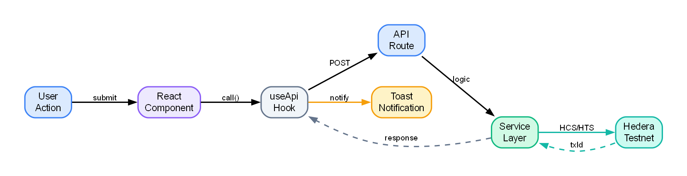
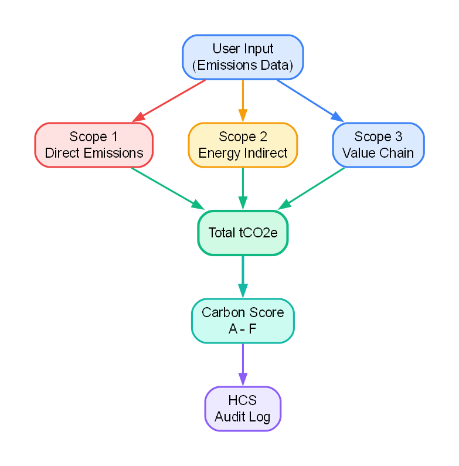
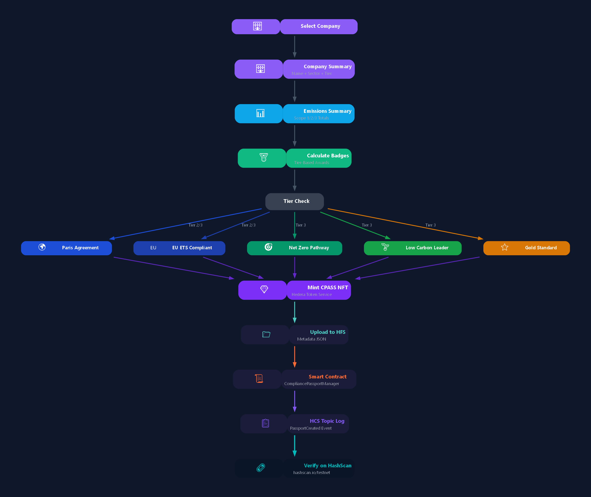
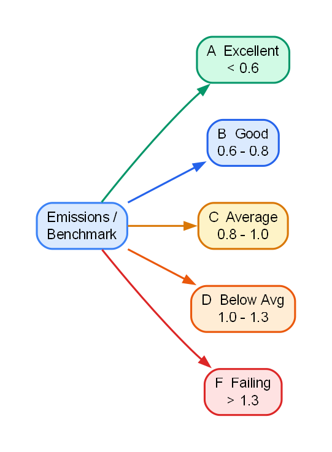
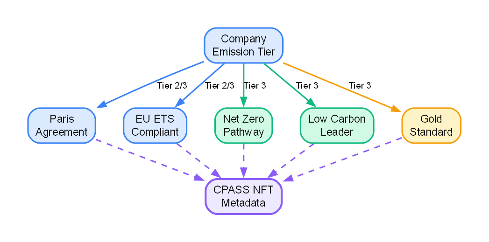
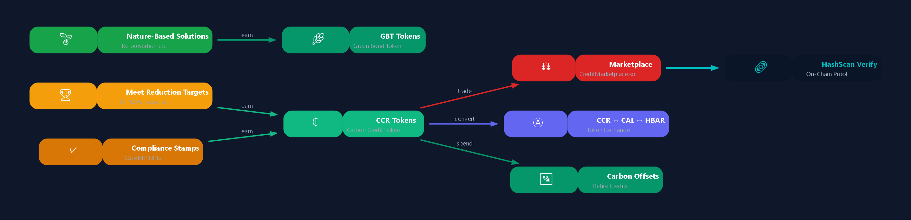

# Hedera Carbon Passport Platform

Corporate Carbon Compliance & Audit Platform built on **Hedera Hashgraph** (Testnet) — a full-stack Next.js application where companies register, report GHG emissions across all scopes, earn tokenized carbon credits, trade allowances under cap-and-trade, and carry dynamic **Carbon Passport NFTs** that accumulate compliance badges from international regulatory frameworks.

## How It Works (Simple Overview)

Companies register on the platform with a Hedera Account ID. They report emissions using GHG Protocol methodologies (Scope 1, 2, 3). The [Emissions Engine](src/services/emissions-engine.service.ts) calculates their carbon footprint and assigns a grade (A–F). Based on their tier and compliance, they mint a **Carbon Passport NFT** (CPASS) on Hedera that contains all company data, emissions metadata, and earned compliance badges. Every action is logged to Hedera Consensus Service topics and verifiable on [HashScan](https://hashscan.io/testnet).

## The Problem

Carbon compliance is fragmented. Companies juggle spreadsheets, disconnected reporting tools, and manual audits across multiple regulatory frameworks (Paris Agreement, EU ETS, CBAM, CORSIA). There's no single source of truth, no tamper-proof audit trail, and no way to programmatically verify a company's carbon credentials.

This platform solves that by anchoring the entire carbon compliance lifecycle to Hedera's public ledger — from company registration through emissions calculation, passport minting, credit trading, and supply chain tracking. Every transaction is immutable, every passport is an NFT, and every claim is verifiable.

## System Architecture

### Platform Architecture



### User Workflow




### Transaction Signing Flow



### Emissions Calculation Flow



### Carbon Passport Minting Flow



## Hedera Services Usage

### HTS — Hedera Token Service

6 custom tokens forming the platform's carbon economy:

| Token | Type | Symbol | Purpose | Token ID |
|-------|------|--------|---------|----------|
| [CCR](src/services/hts.service.ts) | Fungible (2 dec) | Carbon Credit Token | Primary spendable currency — earned by meeting reduction targets | `0.0.8320306` |
| [CAL](src/services/hts.service.ts) | Fungible | Carbon Allowance Token | Emission allowances under cap-and-trade | `0.0.8320307` |
| [CSTAMP](src/services/hts.service.ts) | NFT | Compliance Stamp Token | Issued by regulators as compliance certification | `0.0.8320308` |
| [CPASS](src/services/passport.service.ts) | NFT | Carbon Passport | Dynamic entity passport accumulating stamps and badges | `0.0.8320309` |
| [GBT](src/services/hts.service.ts) | Fungible | Green Bond Token | Earned for nature-based solution investments | `0.0.8320310` |
| [VCLAIM](src/services/claims.service.ts) | NFT | Verifiable Claim Token | Attested sustainability claims | `0.0.8320311` |

### HCS — Hedera Consensus Service

12 HCS topics provide an immutable audit trail:

| Topic | Events Logged | Topic ID |
|-------|--------------|----------|
| CompanyRegistration | CompanyRegistered, ProfileUpdated, TierChanged, ScoreUpdated | `0.0.8320312` |
| EmissionsCalculation | EmissionsSubmitted, EmissionsAmended, FootprintCalculated | `0.0.8320313` |
| CompliancePassport | PassportCreated, StampAdded, MetadataUpdated | `0.0.8320314` |
| CapAndTrade | AllocationCreated, AllowanceTraded, SurplusCalculated | `0.0.8320315` |
| Marketplace | CreditListed, CreditPurchased, CreditRetired | `0.0.8320316` |
| Projections | ProjectionGenerated, ScenarioModeled | `0.0.8320317` |
| AuditReports | ReportGenerated, AnomalyDetected | `0.0.8320318` |
| PolicyCompliance | PolicyEvaluated, ComplianceAchieved, ViolationFlagged | `0.0.8320319` |
| Rewards | MilestoneReached, CCRAwarded, StreakBonusApplied | `0.0.8320320` |
| GuardianMRV | SubmissionCreated, VerificationCompleted | `0.0.8320321` |
| VerifiableClaims | ClaimSubmitted, ClaimAttested, ClaimRejected | `0.0.8320322` |
| SupplyChain | ManufacturingEvent, ShipmentEvent, InspectionEvent | `0.0.8320323` |

### HSCS — Smart Contracts (Solidity)

6 on-chain contracts handle compliance logic, trading mechanics, and identity:

| Contract | Purpose | Contract ID |
|----------|---------|-------------|
| [CompliancePassportManager](contracts/CompliancePassportManager.sol) | CPASS NFT lifecycle, metadata updates, stamp management | `0.0.8320326` |
| [CapTradeManager](contracts/CapTradeManager.sol) | Cap-and-trade allocation, surplus/deficit, allowance transfers | `0.0.8320328` |
| [CreditMarketplace](contracts/CreditMarketplace.sol) | CCR listing, purchasing, retirement with 2% sustainability fee | `0.0.8320330` |
| [RewardDistributor](contracts/RewardDistributor.sol) | Milestone rewards, streak bonuses, CCR distribution | `0.0.8320332` |
| [DIDRegistry](contracts/DIDRegistry.sol) | Decentralized Identity registration and resolution | `0.0.8320334` |
| [ClaimsManager](contracts/ClaimsManager.sol) | Verifiable claim submission, attestation, expiry | `0.0.8320337` |


## Frontend Modules

### Guided Workflow (3-Step Process)

The platform guides users through a 3-step workflow with smooth animated transitions between tabs:

| Step | Module | Description | Source |
|------|--------|-------------|--------|
| 1 | [Company Management](src/components/modules/CompanyRegistration.tsx) | Register companies with Hedera Account ID, sector, revenue, baseline emissions, policy frameworks. List/filter existing companies by Hedera ID. | `CompanyRegistration.tsx` |
| 2 | [Emissions Calculator](src/components/modules/EmissionsCalculator.tsx) | 4-tab module: List (donut chart, bar chart, projections), Create (Scope 1/2/3 form), Projections (6-month forecast with confidence bands), Targets (emission pledges with CCR token rewards). | `EmissionsCalculator.tsx` |
| 3 | [Compliance Dashboard](src/components/modules/ComplianceDashboard.tsx) | Unified view of claims, Guardian MRV submissions, and carbon passports. Mint CPASS NFTs with company/emissions summary and badge preview. | `ComplianceDashboard.tsx` |

### Additional Modules

| Module | Description | Source |
|--------|-------------|--------|
| [Platform Overview](src/components/modules/PlatformOverview.tsx) | Expandable company list with passport dropdowns, badge display, HashScan verify buttons | `PlatformOverview.tsx` |
| [Marketplace](src/components/modules/Marketplace.tsx) | CCR credit listings, purchasing, compliance/voluntary market types | `Marketplace.tsx` |
| [Cap & Trade](src/components/modules/CapTrade.tsx) | CAL allowance allocation, surplus/deficit tracking, inter-company trading | `CapTrade.tsx` |
| [Supply Chain](src/components/modules/SupplyChain.tsx) | Manufacturing, shipment, warehouse, inspection, certification events | `SupplyChain.tsx` |
| [Report Generator](src/components/modules/ReportGenerator.tsx) | Compliance reports in PDF/CSV/JSON with anomaly detection | `ReportGenerator.tsx` |
| [Activity Log](src/components/ActivityLog.tsx) | Persistent transaction log (localStorage) with HashScan verify buttons per record | `ActivityLog.tsx` |
| [Guardian Policies](src/components/modules/GuardianPolicies.tsx) | Manage Hedera Guardian policies, create/publish policies, enforce compliance, reward companies with CCR | `GuardianPolicies.tsx` |

### Shared Components

| Component | Description | Source |
|-----------|-------------|--------|
| [FormField](src/components/ui/FormField.tsx) | Controlled input/select component with LOV dropdowns, hints, validation | `FormField.tsx` |
| [ToastNotifications](src/components/ToastNotifications.tsx) | Fixed-position popup notifications with 5-second timer bar (green→red), HashScan links | `ToastNotifications.tsx` |
| [useApi Hook](src/hooks/useApi.ts) | API call wrapper that auto-logs transactions, extracts Hedera transaction IDs, triggers toasts | `useApi.ts` |
| [useCompanies Hook](src/hooks/useCompanies.ts) | Shared company data fetcher with refresh capability | `useCompanies.ts` |
| [TransactionContext](src/context/TransactionContext.tsx) | Global state for transactions (localStorage persistence) and toast management | `TransactionContext.tsx` |

## Emissions Visualization, Projections & Rewards

The Emissions Calculator module includes 4 interactive tabs:

### List Tab — Visual Analytics
- SVG Donut chart showing Scope 1/2/3 breakdown with animated segments
- Animated Bar chart displaying historical emissions over time
- Inline Projection mini-chart for quick trend visibility
- Summary cards with total emissions, average score, and record count
- CCR rewards banner showing earned tokens from meeting reduction targets

### Projections Tab — 6-Month Forecast
- Linear regression-based emissions forecasting via the [Projection Engine](src/services/projection-engine.service.ts)
- SVG line chart with upper/lower confidence bands
- Trend indicator (increasing/decreasing/stable) and compliance status badges
- Actionable recommendations based on projected trajectory
- Uses `/api/projections/[companyId]` API

### Targets Tab — Emission Pledges & CCR Rewards
- Set emission reduction targets (percentage-based pledges)
- View current emissions as baseline reference
- Earn CCR tokens for meeting milestones: 10% = 100 CCR (Bronze), 25% = 500 CCR (Silver), 50% = 2,000 CCR (Gold), Carbon Neutral = 10,000 CCR (Platinum)
- Earned rewards list with redeemable CCR totals
- Uses `/api/cap-trade/allocate` and `/api/rewards/[companyId]` APIs

### Create Tab — GHG Calculation
- Scope 1/2/3 calculation form with live formula previews
- A–F ratings per scope with expandable methodology details
- Sector-specific emission factors

## Emissions Calculation Engine

The [Emissions Engine](src/services/emissions-engine.service.ts) is a pure calculation module with no side effects. It implements GHG Protocol methodologies with ISO 14067/14040 references.

### Scope 1 — Direct Emissions

```
tCO₂e = quantityConsumed × kgCO₂e/unit ÷ 1000
```

Sector-specific emission factors:

| Sector | Fuels | Factors (kgCO₂e/unit) |
|--------|-------|----------------------|
| Energy | Natural Gas, Diesel, Coal, Fuel Oil | 2.0, 2.68, 2.86, 3.15 |
| Manufacturing | Natural Gas, Diesel, LPG, Process | 2.0, 2.68, 1.51, 1.2 |
| Transportation | Diesel, Gasoline, Jet Fuel, Marine | 2.68, 2.31, 2.52, 3.11 |
| Agriculture | Diesel, Fertilizer, Methane, Natural Gas | 2.68, 4.5, 6.27, 2.0 |
| Services | Natural Gas, Diesel, Electricity Backup | 2.0, 2.68, 0.5 |

### Scope 2 — Indirect Energy Emissions

```
Location-based: tCO₂e = electricityKwh × gridFactor ÷ 1000
Market-based:   tCO₂e = max(0, locationBased − renewableOffset)
```

Grid region factors (kgCO₂e/kWh): US East 0.386, US West 0.283, EU West 0.231, EU North 0.045, UK 0.207, China 0.581, India 0.708, Japan 0.457, Brazil 0.074, Australia 0.656, Canada 0.120.

### Scope 3 — Value Chain Emissions

```
Spend-based:    tCO₂e = spendAmount × spendFactor ÷ 1000
Activity-based: tCO₂e = activityData × activityFactor ÷ 1000
```

| Category | Spend Factor | Activity Factor |
|----------|-------------|----------------|
| Upstream Suppliers | 0.4 | 0.6 |
| Downstream Distribution | 0.3 | 0.5 |
| Business Travel | 0.25 | 0.18 |
| Employee Commuting | 0.15 | 0.12 |

### Carbon Score Rating

Calculated by the [Carbon Score Service](src/services/carbon-score.service.ts) as a ratio of total emissions to sector benchmark:



| Grade | Ratio | tCO₂e Range (UI) |
|-------|-------|-------------------|
| A | < 0.6 | ≤ 500 |
| B | 0.6 – 0.8 | 501 – 2,000 |
| C | 0.8 – 1.0 | 2,001 – 10,000 |
| D | 1.0 – 1.3 | 10,001 – 50,000 |
| F | ≥ 1.3 | > 50,000 |


## Dynamic Carbon Passport (CPASS NFT)

Each company receives a Carbon Passport NFT that:

- Accumulates **compliance badges** based on emission tier and policy framework alignment
- Contains full company metadata, emissions data, and carbon score in NFT metadata
- Is verifiable on [HashScan](https://hashscan.io/testnet) via the "Verify NFT" button on every passport
- Updates metadata when emissions are recalculated or scores change (via [CompliancePassportManager](contracts/CompliancePassportManager.sol))

### Badge System



| Badge | Criteria | Tier Requirement |
|-------|----------|-----------------|
| 🌍 Paris Agreement | Aligned with Paris Agreement targets | Tier 2, Tier 3 |
| 🇪🇺 EU ETS Compliant | Meets EU Emissions Trading System standards | Tier 2, Tier 3 |
| 🎯 Net Zero Pathway | On track for net-zero emissions | Tier 3 only |
| 🌱 Low Carbon Leader | Below sector average emissions | Tier 3 only |
| ⭐ Gold Standard | Verified by Gold Standard | Tier 3 only |

### Emission Tiers

| Tier | Emissions Range | Description |
|------|----------------|-------------|
| Tier 1 | ≥ 100,000 tCO₂e | High emitter |
| Tier 2 | 10,000 – 100,000 tCO₂e | Medium emitter |
| Tier 3 | < 10,000 tCO₂e | Low emitter |

## Tokenized Carbon Economy

CCR tokens function as **spendable currency** throughout the platform:



Milestone rewards: 10% reduction = Bronze (100 CCR), 25% = Silver (500 CCR), 50% = Gold (2,000 CCR), Carbon Neutral = Platinum (10,000 CCR). Managed by the [Reward Service](src/services/reward.service.ts) and [RewardDistributor](contracts/RewardDistributor.sol) contract.

## Policy Framework Alignment

Implemented by the [Policy Framework Service](src/services/policy-framework.service.ts):

| Framework | Coverage |
|-----------|----------|
| Paris Agreement | NDC target tracking per company |
| EU ETS | Sector benchmarks, free allocation, compliance deadlines |
| CBAM | Embedded emissions in imports, certificate calculations |
| CORSIA | Aviation-specific offset requirements |
| Verra VCS / Gold Standard | Voluntary credit verification standards |

## API Endpoints

| Method | Path | Description | Source |
|--------|------|-------------|--------|
| POST | `/api/companies` | Register a new company | [route.ts](src/app/api/companies/route.ts) |
| GET | `/api/companies` | List all companies | [route.ts](src/app/api/companies/route.ts) |
| GET | `/api/companies/[id]` | Get company by ID | [route.ts](src/app/api/companies/[id]/route.ts) |
| GET | `/api/companies/hedera/[accountId]` | Lookup by Hedera Account ID | [route.ts](src/app/api/companies/hedera/[accountId]/route.ts) |
| POST | `/api/emissions/calculate` | Calculate emissions (Scope 1/2/3) | [route.ts](src/app/api/emissions/calculate/route.ts) |
| GET | `/api/emissions/[companyId]` | Get emissions records | [route.ts](src/app/api/emissions/[companyId]/route.ts) |
| POST | `/api/passports` | Mint a CPASS NFT | [route.ts](src/app/api/passports/route.ts) |
| GET | `/api/passports?companyId=` | List passports by company | [route.ts](src/app/api/passports/route.ts) |
| POST | `/api/passports/batch` | Mint batch passport | [route.ts](src/app/api/passports/batch/route.ts) |
| POST | `/api/claims` | Submit a verifiable claim | [route.ts](src/app/api/claims/route.ts) |
| POST | `/api/claims/[claimId]/attest` | Attest a claim (VCLAIM NFT) | [route.ts](src/app/api/claims/[claimId]/attest/route.ts) |
| GET | `/api/claims/company/[companyId]` | List claims by company | [route.ts](src/app/api/claims/company/[companyId]/route.ts) |
| POST | `/api/guardian/verify` | Submit Guardian MRV verification | [route.ts](src/app/api/guardian/verify/route.ts) |
| GET | `/api/guardian/credentials/[companyId]` | List Guardian submissions | [route.ts](src/app/api/guardian/credentials/[companyId]/route.ts) |
| GET | `/api/guardian/policies` | List Guardian policies | [route.ts](src/app/api/guardian/policies/route.ts) |
| POST | `/api/guardian/policies` | Create a new Guardian policy | [route.ts](src/app/api/guardian/policies/route.ts) |
| PUT | `/api/guardian/policies/[policyId]/publish` | Publish a draft policy | [route.ts](src/app/api/guardian/policies/[policyId]/publish/route.ts) |
| POST | `/api/guardian/rewards` | Reward company with CCR for policy compliance | [route.ts](src/app/api/guardian/rewards/route.ts) |
| GET | `/api/marketplace/listings` | List active marketplace listings | [route.ts](src/app/api/marketplace/listings/route.ts) |
| POST | `/api/marketplace/buy` | Purchase CCR credits | [route.ts](src/app/api/marketplace/buy/route.ts) |
| POST | `/api/cap-trade/allocate` | Allocate CAL allowances | [route.ts](src/app/api/cap-trade/allocate/route.ts) |
| GET | `/api/cap-trade/balance/[companyId]` | Get CAL balance | [route.ts](src/app/api/cap-trade/balance/[companyId]/route.ts) |
| GET | `/api/did/[did]` | Resolve a DID document | [route.ts](src/app/api/did/[did]/route.ts) |
| POST | `/api/projections/[companyId]` | Generate 6-month emissions projection | [route.ts](src/app/api/projections/[companyId]/route.ts) |
| GET | `/api/projections/[companyId]` | Retrieve latest projection | [route.ts](src/app/api/projections/[companyId]/route.ts) |
| GET | `/api/rewards/[companyId]` | Get earned CCR rewards | [route.ts](src/app/api/rewards/[companyId]/route.ts) |
| GET | `/api/rewards/milestones/[companyId]` | Get milestone progress | [route.ts](src/app/api/rewards/milestones/[companyId]/route.ts) |
| GET | `/api/policy/[companyId]` | Evaluate policy compliance | [route.ts](src/app/api/policy/[companyId]/route.ts) |


## Service Layer

22 backend services handle all business logic, Hedera interactions, and data persistence:

| Service | Responsibility | Source |
|---------|---------------|--------|
| Company Service | Registration, DID creation, tier assignment | [company.service.ts](src/services/company.service.ts) |
| Emissions Engine | Pure GHG Protocol calculations (Scope 1/2/3) | [emissions-engine.service.ts](src/services/emissions-engine.service.ts) |
| Carbon Score Service | A–F grading, benchmark comparison, CPASS metadata updates | [carbon-score.service.ts](src/services/carbon-score.service.ts) |
| Passport Service | CPASS NFT minting, metadata management, stamp attachment | [passport.service.ts](src/services/passport.service.ts) |
| Claims Service | Verifiable claim submission, VCLAIM NFT attestation | [claims.service.ts](src/services/claims.service.ts) |
| Guardian MRV Service | ISO 14067/14040 LCA verification via Hedera Guardian | [guardian.service.ts](src/services/guardian.service.ts) |
| DID Service | Decentralized Identity creation and resolution | [did.service.ts](src/services/did.service.ts) |
| Marketplace Service | CCR credit listing, purchasing, retirement | [marketplace.service.ts](src/services/marketplace.service.ts) |
| Cap-Trade Service | CAL allocation, surplus/deficit, allowance transfers | [cap-trade.service.ts](src/services/cap-trade.service.ts) |
| Policy Framework Service | Multi-framework compliance evaluation | [policy-framework.service.ts](src/services/policy-framework.service.ts) |
| Reward Service | Milestone detection, CCR reward distribution | [reward.service.ts](src/services/reward.service.ts) |
| Projection Engine | Bi-yearly emissions forecasting, scenario modeling | [projection-engine.service.ts](src/services/projection-engine.service.ts) |
| Audit Service | Compliance report generation, anomaly detection | [audit.service.ts](src/services/audit.service.ts) |
| HTS Service | Token minting, transfers, burns via Hedera SDK | [hts.service.ts](src/services/hts.service.ts) |
| HCS Service | Consensus message submission and topic management | [hcs.service.ts](src/services/hcs.service.ts) |
| HSCS Service | Smart contract deployment and function calls | [hscs.service.ts](src/services/hscs.service.ts) |
| HFS Service | File upload/download on Hedera File Service | [hfs.service.ts](src/services/hfs.service.ts) |
| Mirror Node Service | Read-only queries against Hedera Mirror Node | [mirror-node.service.ts](src/services/mirror-node.service.ts) |
| Supply Chain Event Service | Manufacturing, shipment, inspection event tracking | [supply-chain-event.service.ts](src/services/supply-chain-event.service.ts) |
| State Reconstruction Service | Rebuild state from HCS topic messages | [state-reconstruction.service.ts](src/services/state-reconstruction.service.ts) |
| Scheduler Service | Periodic tasks (projections, score recalculation) | [scheduler.service.ts](src/services/scheduler.service.ts) |
| Standards Registry Service | ISO/GHG standard metadata management | [standards-registry.service.ts](src/services/standards-registry.service.ts) |

## Why This Needs to Be On-Chain

A traditional Web2 approach would store emissions data in a private database. This creates trust issues — companies could manipulate their own records, auditors have no independent verification, and regulators can't programmatically verify compliance.

By anchoring to Hedera's public ledger:

- Every emissions report is logged to HCS — tamper-proof and timestamped by consensus
- Carbon Passports are NFTs — ownership and metadata are publicly verifiable
- Smart contracts enforce compliance rules — the code can't be bypassed
- Carbon credits (CCR) are fungible tokens — transfers are atomic and auditable
- DID documents provide cryptographic identity — companies can't impersonate each other

## Quick Start

### Prerequisites

- Node.js 18+
- Hedera Testnet account ([portal.hedera.com](https://portal.hedera.com))
- PostgreSQL (optional — falls back to local JSON store)

### 1. Install & Configure

```bash
git clone <repo-url> && cd carbon-passport-platform
npm install
cp .env.local.example .env.local
# Edit .env.local with your Hedera operator credentials
```

### 2. Environment Variables

| Variable | Required | Description |
|----------|----------|-------------|
| `HEDERA_OPERATOR_ID` | Yes | Hedera account ID (e.g., `0.0.XXXXX`) |
| `HEDERA_HEXCODED_KEY` | Yes | Hedera private key (hex-encoded) |
| `HEDERA_NETWORK` | Yes | `testnet`, `previewnet`, or `mainnet` |
| `DATABASE_URL` | No | PostgreSQL connection string |
| `HEDERA_MIRROR_NODE_URL` | No | Mirror Node URL (defaults to testnet) |
| `REDIS_URL` | No | Redis URL for caching |
| `GUARDIAN_API_URL` | No | Guardian API URL (enables Guardian mode) |

### 3. Deploy Platform

```bash
npx tsx scripts/deploy.ts
```

Creates all 6 tokens, 12 HCS topics, 3 platform accounts, compiles and deploys 6 smart contracts, and persists everything to [`config/platform-config.json`](config/platform-config.json).

### 4. Run Development Server

```bash
npx next dev --turbopack
```

Open [http://localhost:3000](http://localhost:3000) to access the dashboard.

### 5. Set Up Hedera Guardian (Optional)

Guardian provides on-chain MRV (Measurement, Reporting, Verification) through a policy workflow engine. Without Guardian, the platform uses a built-in local ISO 14067/14040 policy engine.

**Prerequisites:** [Docker Desktop](https://www.docker.com/products/docker-desktop/)

```powershell
# Automated setup (Windows PowerShell)
.\scripts\setup-guardian.ps1
```

Or manually:

```bash
# 1. Clone Guardian
git clone --depth 1 https://github.com/hashgraph/guardian.git guardian

# 2. Configure Guardian .env (in guardian/ directory)
#    Set OPERATOR_ID and OPERATOR_KEY from your .env.local
#    Set HEDERA_NET=testnet

# 3. Start Guardian
cd guardian
docker compose -f deploy/docker-compose.yml --profile all up -d

# 4. Wait for Guardian API at http://localhost:3000
# 5. Create users: StandardRegistry, VVB, ProjectProponent (password: test)
```

The platform auto-detects Guardian connectivity. When Guardian is running, the Compliance Dashboard and Guardian MRV module show a green "Guardian Connected" badge. When unavailable, they fall back to the local policy engine with an amber "Local Engine" badge.

| Variable | Default | Description |
|----------|---------|-------------|
| `GUARDIAN_API_URL` | — | Guardian API base URL (e.g., `http://localhost:3000/api/v1`) |
| `GUARDIAN_SR_USERNAME` | `StandardRegistry` | Standard Registry username |
| `GUARDIAN_SR_PASSWORD` | `test` | Standard Registry password |
| `GUARDIAN_VVB_USERNAME` | `VVB` | Validation/Verification Body username |
| `GUARDIAN_VVB_PASSWORD` | `test` | VVB password |
| `GUARDIAN_USER_USERNAME` | `ProjectProponent` | Project Proponent username |
| `GUARDIAN_USER_PASSWORD` | `test` | Project Proponent password |
| `GUARDIAN_POLICY_MESSAGE_ID` | — | Hedera message ID to import a policy from |

### 6. Seed Test Data (Optional)

```bash
npx tsx scripts/seed.ts
```

### 7. Regenerate Diagrams (Optional)

```bash
python scripts/generate-diagrams.py
```

Generates 8 clean architecture diagrams in `docs/diagrams/` using Graphviz. Requires `pip install graphviz` and the Graphviz binary (`dot`).

## Verifying on Hedera

All on-chain assets are verifiable on [HashScan](https://hashscan.io/testnet). Every module includes "Verify on HashScan" buttons that link directly to the relevant transaction or NFT.

| Asset Type | URL Pattern |
|-----------|-------------|
| Tokens | `https://hashscan.io/testnet/token/<TOKEN_ID>` |
| NFTs | `https://hashscan.io/testnet/token/<TOKEN_ID>/<SERIAL>` |
| HCS Topics | `https://hashscan.io/testnet/topic/<TOPIC_ID>` |
| Smart Contracts | `https://hashscan.io/testnet/contract/<CONTRACT_ID>` |
| Transactions | `https://hashscan.io/testnet/transaction/<TX_ID>` |

Token IDs, topic IDs, and contract IDs are stored in [`config/platform-config.json`](config/platform-config.json).


## Project Structure

```
carbon-passport-platform/
├── src/
│   ├── app/
│   │   ├── page.tsx                          # Main dashboard with tab navigation
│   │   ├── layout.tsx                        # Root layout with TransactionProvider + Toasts
│   │   └── api/                              # 20+ API routes
│   │       ├── companies/                    # Company CRUD + Hedera lookup
│   │       ├── emissions/                    # Emissions calculation + history
│   │       ├── passports/                    # CPASS NFT minting + batch + items
│   │       ├── claims/                       # Verifiable claims + attestation
│   │       ├── guardian/                     # Guardian MRV verification
│   │       ├── marketplace/                  # CCR credit trading
│   │       ├── cap-trade/                    # CAL allowance management
│   │       └── did/                          # DID resolution
│   ├── components/
│   │   ├── modules/
│   │   │   ├── CompanyRegistration.tsx        # Step 1: Company list/create with Hedera ID filter
│   │   │   ├── EmissionsCalculator.tsx        # Step 2: GHG calculation with formulas + ratings
│   │   │   ├── ComplianceDashboard.tsx        # Step 3: Unified claims + MRV + passport minting
│   │   │   ├── PlatformOverview.tsx           # Expandable company/passport overview
│   │   │   ├── Marketplace.tsx                # CCR credit marketplace
│   │   │   ├── CapTrade.tsx                   # Cap-and-trade allowance management
│   │   │   ├── SupplyChain.tsx                # Supply chain event tracking
│   │   │   ├── ReportGenerator.tsx            # Compliance report generation
│   │   │   ├── PassportMinting.tsx            # Standalone passport minting (legacy)
│   │   │   ├── ClaimsManager.tsx              # Standalone claims manager (legacy)
│   │   │   ├── GuardianMRV.tsx                # Standalone Guardian MRV (legacy)
│   │   │   └── GuardianPolicies.tsx           # Guardian policy management + CCR rewards
│   │   ├── ui/
│   │   │   └── FormField.tsx                  # Controlled input/select with LOV dropdowns
│   │   ├── ActivityLog.tsx                    # Persistent transaction log
│   │   └── ToastNotifications.tsx             # Popup notifications with timer bar
│   ├── context/
│   │   └── TransactionContext.tsx             # Global transaction state + localStorage
│   ├── hooks/
│   │   ├── useApi.ts                          # API wrapper with auto-logging
│   │   └── useCompanies.ts                    # Shared company data hook
│   ├── services/                              # 22 backend services (see Service Layer)
│   ├── config/
│   │   └── tokens.config.ts                   # Token configuration
│   └── lib/
│       ├── hedera/
│       │   ├── client.ts                      # Hedera SDK client initialization
│       │   └── accounts.ts                    # Account management
│       ├── api/
│       │   ├── response.ts                    # Standardized API responses
│       │   ├── validation.ts                  # Zod request validation
│       │   └── contract-guard.ts              # Smart contract interaction guard
│       ├── local-db.ts                        # JSON file-based fallback database
│       ├── local-store.ts                     # Key-value config store
│       └── hcs-messages.ts                    # HCS message type definitions
├── contracts/                                 # 6 Solidity smart contracts
├── config/
│   └── platform-config.json                   # Deployed Hedera asset IDs
├── prisma/
│   └── schema.prisma                          # 18 database models
├── scripts/
│   ├── deploy.ts                              # Full platform deployment script
│   └── seed.ts                                # Test data seeder
└── data/
    └── local-db.json                          # Local JSON database (fallback)
```

## Design Decisions

| Decision | Rationale |
|----------|-----------|
| Next.js 16 + Turbopack | Fast dev server, API routes co-located with frontend, React 19 support |
| Hedera SDK v2.81.0 | Native secp256k1 signing, HTS/HCS/HSCS/HFS in one SDK |
| Pure calculation engine | [Emissions Engine](src/services/emissions-engine.service.ts) has zero side effects — testable, auditable |
| Inline styles (CSSProperties) | No build-time CSS tooling needed, component-scoped, zero CSS conflicts |
| localStorage for activity log | Persists across hard refreshes without backend dependency |
| Toast notifications (not modals) | Non-blocking UX — user sees result without interrupting workflow |
| Unified Compliance Dashboard | Replaced 3 separate components (Claims, Guardian, Passport) with single view |
| LOV dropdowns (not UUID inputs) | Users select companies from dropdown instead of typing UUIDs |
| Hedera Account ID filter | Companies searchable by their Hedera ID, not internal database IDs |
| Smart contract + HCS dual logging | On-chain logic enforcement + immutable audit trail |

## Tech Stack

| Component | Technology |
|-----------|-----------|
| Runtime | Node.js 18+ |
| Framework | Next.js 16 (Turbopack) |
| Language | TypeScript 5.9 |
| Frontend | React 19 |
| Blockchain | Hedera SDK v2.81.0 |
| Smart Contracts | Solidity (Hardhat) |
| Database | PostgreSQL (Prisma ORM) / JSON fallback |
| Validation | Zod |
| Caching | Redis (optional) |
| MRV Engine | Hedera Guardian (Docker, optional) |
| Testing | Jest + ts-jest |

## Full Requirements

See [Realtime_Carbon_Rework.md](./Realtime_Carbon_Rework.md) for the complete requirements document covering all 12 requirement areas.
